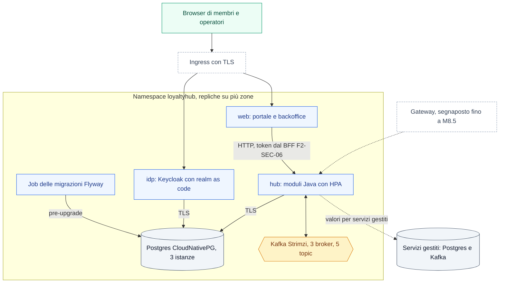

Il profilo `enterprise` si installa dalla **stessa immagine** in tre tagli: appliance a un container, compose di riferimento e chart Helm. Cambiano solo il ruolo di ogni container (`LH_ROLE`) e il posto dell'infrastruttura. Questa pagina riassume i due tagli disponibili da M8.3; comandi, valori e variabili completi sono in `deploy/README.md` del repository.

## Topologia del chart Helm

Ogni ruolo dell'immagine è un Deployment con repliche distribuite tra le zone. L'Ingress porta il browser al ruolo `web` (portale e backoffice) e al login del ruolo `idp`; l'hub resta interno e lo chiama il web. Postgres e Kafka sono gestiti dagli operatori CloudNativePG e Strimzi, installati prima come prerequisiti, oppure sono servizi gestiti fuori dal cluster.

## Cosa fa il chart

- **Un Deployment per ruolo**: `hub` (tutti i moduli Java), `web`, `idp`. I ruoli `cms` e `jobs` non sono ancora nell'immagine e il chart rifiuta di abilitarli.
- **Operatori di default, servizi gestiti come valori**: `postgres.mode` e `kafka.mode` valgono `cloudnativepg` e `strimzi`; con `external` il chart non crea risorse degli operatori.
- **Immagine obbligatoria**: `image.repository` e `image.tag` non hanno default; si indica una versione pubblicata (tag `v*` del repository) o un digest.
- **Migrazioni come Job**: stessa immagine, solo Flyway, prima dell'aggiornamento dei Pod (`pre-upgrade`).
- **Sicurezza**: Pod Security `restricted`, filesystem in sola lettura, nessun token del service account, nessun segreto nei valori: solo riferimenti a Secret esistenti. Nel profilo `enterprise` Kafka e Postgres esterni senza cifratura sono rifiutati, salvo deroga esplicita.
- **Scala**: HPA su `hub` e `web`, PDB, partizioni e concorrenza dei consumer configurabili.
- **Installazione**: il primo avvio di Kafka, Postgres e Keycloak richiede alcuni minuti; si installa con `helm install … --wait --timeout 15m`.

## Compose di riferimento

`deploy/compose/reference.yml` avvia Postgres, Kafka KRaft, le migrazioni, `hub`, `web` e `idp` con la stessa immagine. Non è HA: è il taglio per chi installa su Docker senza Kubernetes. I segreti arrivano dall'ambiente e un container a cui ne manca uno non parte. Keycloak usa un ruolo Postgres proprio; `web` e `idp` sono pubblicati solo su `127.0.0.1` perché parlano HTTP in chiaro: per altri accessi serve un reverse proxy con TLS (Q-392).

## Partizioni, concorrenza e retention

I cinque topic mantengono sempre gli stessi nomi. Variano partizioni (12 nel chart), repliche (3), `min.insync.replicas` (2), retention per topic e numero di consumer per listener, tramite le variabili `LH_KAFKA_*` o i valori del chart. Senza configurazione valgono i default della demo: 2 partizioni, 1 replica, 3 giorni.

Una retention cambiata arriva ai topic già esistenti solo con `LH_KAFKA_TOPICS_MODIFY_CONFIGS` (acceso nel profilo `enterprise`, spento nella demo); con Strimzi la applica l'operatore.

<Warning>
Aumentare le partizioni sposta le chiavi `memberId` su altre partizioni: gli eventi ancora in volo di uno stesso membro possono essere consumati fuori ordine. Si aumentano solo dopo aver svuotato i consumer (produttori fermi, lag 0) e con `LH_KAFKA_TOPICS_ALLOW_PARTITION_INCREASE=true` (chart: `kafka.topics.allowPartitionIncrease=true`), da riportare a `false` subito dopo. Senza conferma l'hub non parte e il chart rifiuta l'upgrade. Le partizioni non si possono diminuire.
</Warning>

<Note>
Limiti noti di questa versione: nel profilo `enterprise` il web ha il BFF OIDC (login, sessione lato server, token verso l'hub; vedi [Autenticazione](/api/autenticazione)) ma chart e compose non gli passano ancora emittente, segreto del client `web` e chiave delle sessioni, quindi il ruolo `web` rifiuta di partire con `INSECURE_CONFIG` invece di girare senza login (Q-393, Q-412; per valutare si usa il profilo `demo`); **il portale in `enterprise` non va esposto a membri reali finché M8.10 non lega il membro al token nei servizi** (`MemberPrincipal`): il BFF rifiuta ogni `memberId` scelto dal browser, ma resta una difesa in più, non il controllo di proprietà (Q-410); il compose di riferimento parla HTTP in chiaro (Q-392); nessuna NetworkPolicy fino a M8.5; `facts` e `audit` restano a 7 giorni finché i dati personali non sono fuori dal bus (Q-373); il ruolo `idp` usa l'immagine ufficiale di Keycloak (Q-374); Kafka interno senza TLS fino alla sicurezza di piattaforma di M8.5 (Q-375).
</Note>
