L'osservabilità del profilo `enterprise` è **spenta di default**: nessuna telemetria esce dal prodotto senza un URL scelto da chi lo installa (ADR-044). Questa prima parte (M8.6a) copre le **metriche**: l'hub le invia in OTLP a un collector OpenTelemetry, che le inoltra al Prometheus dell'adottante; una dashboard Grafana e le regole di Prometheus misurano gli obiettivi di ADR-036 e allertano sui segnali di sicurezza e di salute del bus. Tracce, log e la strumentazione del web arrivano con M8.6b.

## Percorso delle metriche

L'hub spinge le metriche (push) perché `/actuator/prometheus` non esiste e, nel profilo `enterprise`, `/actuator/*` richiede un ruolo operatore: nessun endpoint in ingresso, nessun endpoint pubblico. Prometheus e Grafana sono prerequisiti dell'adottante; il chart porta il collector, la dashboard e le regole.

```mermaid
flowchart LR
  accTitle: Percorso delle metriche nel profilo enterprise
  accDescr: L'hub, con i moduli Java e insight, invia le metriche in OTLP HTTP sulla porta 4318 al collector OpenTelemetry, che le inoltra al ricevitore OTLP di Prometheus, installato da chi adotta il prodotto. Prometheus valuta le regole SLO e passa gli allarmi ad Alertmanager, che avvisa l'operatore. L'operatore legge in Grafana la dashboard Loyalty Hub SLO, che interroga Prometheus con PromQL.
  HUB[hub: moduli Java e insight]
  COL[Collector OpenTelemetry]
  PROM[(Prometheus di chi installa)]
  AM[Alertmanager di chi installa]
  GRAF[Grafana: dashboard Loyalty Hub — SLO]
  OPS[Operatore]
  HUB -->|OTLP HTTP, porta 4318| COL
  COL -->|OTLP, /api/v1/otlp| PROM
  PROM -->|regole SLO e allarmi| AM
  GRAF -->|PromQL| PROM
  OPS --> GRAF
  AM -.-> OPS
  classDef svc fill:#EFF6FF,stroke:#2563EB,color:#1E3A8A
  classDef store fill:#F1F5F9,stroke:#475569,color:#0F172A
  classDef topic fill:#FEF3C7,stroke:#D97706,color:#78350F
  classDef ext fill:#FFFFFF,stroke:#94A3B8,stroke-dasharray:4 2,color:#334155
  classDef human fill:#ECFDF5,stroke:#059669,color:#064E3B
  class HUB,COL svc
  class PROM store
  class AM,GRAF ext
  class OPS human
```



Ogni metrica porta la risorsa `service.name=hub`, `service.namespace` (di default `loyaltyhub`) e `service.instance.id` (il nome del Pod): in Prometheus il `job` vale `<namespace>/hub`. Con più installazioni su uno stesso Prometheus si sceglie un namespace diverso per ciascuna, sempre con prefisso `loyaltyhub`, perché regole e dashboard selezionano `job=~"loyaltyhub[^/]*/hub"`.

## Cosa misura

Gli obiettivi sono quelli di ADR-036. La dashboard «Loyalty Hub — SLO» mostra per ciascuno il valore corrente, il budget d'errore residuo su 30 giorni e il consumo del budget; le regole registrano gli stessi rapporti su quattro finestre e ne derivano gli allarmi.

| Obiettivo | Indicatore | Metrica di origine |
|---|---|---|
| Portale disponibile al 99,9 % | quota di risposte non 5xx su `/v1/portal/*` (30 giorni) | `http_server_requests_seconds_count` (hub) |
| Giocata p99 sotto 500 ms | quota di `POST /v1/portal/contests/{code}/play` entro 500 ms e p99 (30 giorni e 1 ora) | `http_server_requests_seconds_bucket` (hub), bucket a 500 ms |
| Azione → punti p95 sotto 5 s | quota di accrediti `wallet.points.earned` entro 5 s dall'azione radice e p95 (30 giorni e 1 ora) | `lh_action_to_points_seconds_bucket` (insight), bucket a 5 s |

L'indicatore azione → punti nasce in insight: alla registrazione di un accredito nuovo, legge dall'event store l'azione radice del tracciato e registra il tempo trascorso dalla sua registrazione. Non porta etichette e non fa chiamate tra servizi. RPO 15 minuti e RTO 1 ora non si misurano dall'applicazione: li verifica la prova di ripristino, e le metriche di archiviazione di CloudNativePG arrivano con M8.6b.

## Allarmi

Le regole stanno in un solo file, `deploy/helm/loyaltyhub/files/observability/slo-rules.json`, letto dal chart (come `PrometheusRule`) e dal compose. Il consumo del budget d'errore segue la pratica comune dei burn rate: 14,4 volte il ritmo sostenibile su 1 ora e 5 minuti (critico, dopo 2 minuti) e 6 volte su 6 ore e 30 minuti (avviso, dopo 15 minuti).

| Allarme | Scatta quando | Gravità |
|---|---|---|
| `LoyaltyHubPortalAvailabilityBurnRateFast` e `…Slow` | il budget dello 0,1 % del portale si consuma troppo in fretta | critica e avviso |
| `LoyaltyHubPlayLatencyBurnRateFast` e `…Slow` | più dell'1 % delle giocate supera 500 ms a ritmo insostenibile | critica e avviso |
| `LoyaltyHubActionToPointsBurnRateFast` e `…Slow` | più del 5 % degli accrediti supera 5 s a ritmo insostenibile | critica e avviso |
| `LoyaltyHubDlqMessages` | messaggi nella coda degli errori negli ultimi 10 minuti, per codice d'errore | avviso |
| `LoyaltyHubMessageRejected` | eventi rifiutati per `SIGNATURE_INVALID` o `PRODUCER_NOT_ALLOWED` | critica |
| `LoyaltyHubAuthFailureSpike` | più di una risposta 401 o 403 al secondo per 10 minuti | avviso |
| `LoyaltyHubOutboxBacklog` | più di 1000 eventi in attesa di pubblicazione per 10 minuti | avviso |
| `LoyaltyHubTelemetryAbsent` | nessuna metrica dall'hub da 10 minuti | avviso |

Gli allarmi sulla coda degli errori vedono anche la prima occorrenza di un codice d'errore mai visto prima: un contatore nasce con valore 1 e un semplice aumento su una finestra non la noterebbe. L'instradamento degli allarmi (Alertmanager, SIEM) è dell'adottante; l'esportazione verso un SIEM arriva con M8.6b.

## Attivarla nel chart

Servono Prometheus 3 o successivo con il ricevitore OTLP (`--web.enable-otlp-receiver`), la strategia di traduzione `UnderscoreEscapingWithSuffixes`, una finestra fuori ordine di almeno 30 minuti e Grafana con il sidecar dei dashboard. La destinazione è obbligatoria e si indica **senza** `/v1/metrics`:

```bash
helm upgrade --install lh deploy/helm/loyaltyhub … \
  --set observability.enabled=true \
  --set observability.prometheus.otlpEndpoint=http://prometheus-operated.monitoring.svc:9090/api/v1/otlp \
  --set observability.prometheusRule.enabled=true
```

Il chart aggiunge il collector (Deployment con due repliche, Service, PDB e una NetworkPolicy che ammette solo i Pod `hub` sulla porta 4318), la dashboard come ConfigMap per il sidecar di Grafana e, se richiesta e con i CRD del Prometheus Operator, la `PrometheusRule`. Nel profilo `enterprise` la destinazione deve essere `https`, oppure `http` verso un Service del cluster; altrimenti il chart si ferma con `INSECURE_CONFIG`, salvo deroga esplicita (`observability.prometheus.allowInsecure`). Il token e la CA di Prometheus arrivano solo da un Secret e da un ConfigMap esistenti.

## Attivarla nel compose di riferimento

```bash
LH_OTEL_METRICS_ENABLED=true LH_GRAFANA_ADMIN_PASSWORD=… \
  docker compose -f deploy/compose/reference.yml --profile observability up -d
```

Il profilo `observability` aggiunge il collector, Prometheus e Grafana, con la dashboard e le regole già caricate. Collector e Prometheus non hanno porte pubblicate; Grafana risponde su `http://127.0.0.1:3001` con la password scelta e senza accesso anonimo.

## Dati personali e destinazioni (ADR-044)

- Le etichette sono tecniche: tipo di evento, codice d'errore, metodo e stato HTTP, e `uri` come modello del percorso (`/v1/portal/contests/{code}/play`), mai un identificativo di membro.
- Non si esportano tracce né log.
- Non esiste una destinazione di default: con l'osservabilità spenta, o senza l'URL scelto, non esce nulla. Grafana nel compose non contatta Grafana Labs.
- Il ricevitore del collector non autentica: fino a M8.5 (mTLS di mesh) lo protegge la NetworkPolicy.

## Cosa arriva con M8.6b

Tracce (Tempo) e log (Loki), la strumentazione del web e di Keycloak, le metriche di Strimzi e CloudNativePG (lag, WAL), KEDA, il login OIDC di Grafana, l'instradamento degli allarmi e l'esportazione verso un SIEM.
