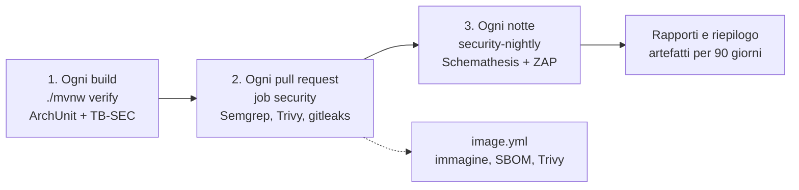

La conformità di sicurezza non è una checklist: la verifica il software, a tre livelli che costano sempre di più e girano sempre meno spesso. Questa pagina dice cosa controlla ciascun livello, cosa lo fa fallire e come si riproduce un esito in locale. I dettagli operativi sono nei documenti `docs/security/ci-security.md` (job `security`) e `docs/security/dast.md` (verifica notturna) del repository.

## I tre livelli



| Livello | Dove | Cosa prova | Quando |
|---|---|---|---|
| 1 | `./mvnw verify` | regole ArchUnit (ogni endpoint dichiara `@RequiresRole` o `@PublicEndpoint`) e testbook `TB-SEC`: iniezioni, byte NUL, input di 10 000 caratteri, path traversal, CRLF ed espressioni di template su API vere; errori senza stack trace né dettagli interni | a ogni build |
| 2 | job `security` di `ci.yml` | regole Semgrep del progetto (SQL solo parametrico, niente SpEL o header dall'input), Trivy sulle dipendenze e sull'infrastruttura come codice, gitleaks sulla storia | a ogni pull request e su `main` |
| 3 | workflow `security-nightly` | Schemathesis su ogni operazione di `contracts/api` e ZAP API scan autenticato, contro l'hub costruito dal commit in una rete Docker senza uscita | ogni notte, a mano e sulle PR che ne toccano i file |

Le immagini si scansionano e si firmano in `image.yml` (SBOM CycloneDX, Trivy, cosign): è un altro controllo, descritto in `docs/security/supply-chain.md`.

## Cosa blocca

Il fuzzing e lo ZAP sono **consultivi**: non sono tra i controlli obbligatori del merge, ma una PR li vede a colpo d'occhio.

- **Schemathesis** fa fallire il job su un `5xx` che non è nella baseline con scadenza, su una voce di baseline scaduta o senza motivo, su errori o timeout, su una specifica in cui non ha provato alcuna operazione, e se il bersaglio non parte o non è isolato.
- **ZAP** fa fallire il job su un avviso **High** (con confidenza diversa da 0) non coperto da un'eccezione con scadenza, su un'eccezione non valida, su un errore di ZAP o su un rapporto senza URL importati.
- **Medium, Low e Info** non bloccano mai: restano nel riepilogo e nel rapporto HTML.

## Esiti accettati con scadenza

Un difetto noto che non si corregge subito si accetta **per iscritto**: una voce nella baseline di Schemathesis (`.dast/schemathesis-baseline.json`) o nelle eccezioni di ZAP (`.dast/zap-exceptions.json`), sempre con una scadenza entro 90 giorni, un motivo (la causa verificata, in italiano) e il riferimento a una domanda aperta (`Q-nnn`) o a una voce del backlog (`TOBE-nnn`). Alla scadenza il difetto torna a far fallire il job, così non si dimentica. Nessuna eccezione senza scadenza, motivo e riferimento: gli script rifiutano una voce che non li ha.

Una voce di baseline di Schemathesis copre **ogni `500` della stessa operazione**, non solo quello analizzato: finché resta, su quell'operazione il fuzzing non vede `5xx` nuovi e il minimo deterministico è il testbook `TB-SEC`. Per lo stesso motivo il job di fuzzing è atteso rosso finché le prime correzioni di Q-532 non arrivano; sulle pull request il suo esito è solo informativo.

## Riprodurre in locale

Con Docker, come in CI:

```bash
docker build -f deploy/image/Dockerfile -t lh-image:dast .
npm --prefix scripts ci --omit=dev
bash scripts/security-target.sh up      # hub, Kafka e Postgres in una rete senza uscita
bash scripts/security-fuzz.sh           # Schemathesis: rapporti in target/security/fuzz/
bash scripts/security-zap.sh            # ZAP: rapporti in target/security/zap/
bash scripts/security-target.sh down
```

Senza Docker, Schemathesis si lancia contro un hub già avviato: `SCHEMATHESIS=<binario> LH_FUZZ_URL=<url> bash scripts/security-fuzz.sh`. Il testbook di sicurezza gira con `./mvnw -pl deploy/hub -am verify -Dit.test=TestbookSecHubIT`. Le versioni degli strumenti, come registrare i difetti trovati e cosa cambia tra un'esecuzione locale e la CI sono in `docs/security/dast.md`.
