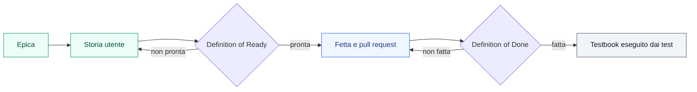

{/* Generato da scripts/docs-sync.mjs a partire da docs/17-EPIC-E-STORIE.md: non modificare a mano. */}

Il backlog raccoglie le epiche e le storie utente del Loyalty Hub, di Fase 1 (la PoC) e di Fase 2 (la piattaforma enterprise). Ogni storia ha la forma delle cerimonie agile: chi la chiede, cosa vuole e perché, il contesto reale del programma demo «Club Aurora», i criteri di accettazione *Dato/Quando/Allora* e il dominio del testbook che la prova.

Usa queste pagine per sapere, storia per storia, se è **pronta** per entrare in una fetta (Definition of Ready) e se è **fatta** (Definition of Done). Lo stato non lo scrive nessuno a mano: lo calcola `scripts/docs-sync.mjs` dal sorgente [`docs/17-EPIC-E-STORIE.md`](https://github.com/peppe-ruv/Loyalty_Sys/blob/main/docs/17-EPIC-E-STORIE.md) e dalle evidenze del repository.

<Note>
  Oggi il backlog ha 227 storie: 190 pronte, 130 fatte, 4 con la DoD da verificare e 3 fuori perimetro della PoC. Le voci basate sulle evidenze del repository sono aggiornate all'ultimo refresh: commit `f69d808` del 2026-09-29.
</Note>

## Dall'epica alla storia fatta

Una storia nasce dentro un'epica. Quando soddisfa la Definition of Ready entra in una fetta, cioè un ramo e una pull request verso `main`. Dopo il merge la Definition of Done cerca le evidenze: la feature spuntata in `docs/14`, le righe di testbook eseguite dai test, nessuno scostamento aperto.



## Epiche di Fase 1

Le epiche della PoC: il ciclo completo dall'azione del cliente ai punti, ai premi, al gioco e alla governance.

| Epica | Obiettivo | Storie | DoR pronte | DoD fatte |
|---|---|--:|--:|--:|
| [E01 Ingresso eventi](/specifiche/backlog/e01-ingresso-eventi) | ogni fatto del cliente diventa un'azione canonica, una sola volta, per il membro giusto | 14 (1 fuori perimetro) | 12 | 10 |
| [E02 Membri e segmenti](/specifiche/backlog/e02-membri-e-segmenti) | anagrafica affidabile, stati, privacy, segmenti usati da campagne/premi/contenuti | 13 (1 fuori perimetro) | 12 | 9 |
| [E03 Campagne e motore regole](/specifiche/backlog/e03-campagne-e-motore-regole) | regole configurabili, spiegabili, simulabili, con limiti e budget | 19 (1 fuori perimetro) | 18 | 15 |
| [E04 Wallet, livelli ed edizioni](/specifiche/backlog/e04-wallet-livelli-ed-edizioni) | punti a doppia valuta, lotti e scadenze, tier annuali con discesa morbida | 16 | 15 | 15 |
| [E05 Premi e coupon](/specifiche/backlog/e05-premi-e-coupon) | catalogo a fasce, richiesta premio in saga, coupon ed evasione | 17 | 17 | 15 |
| [E06 Gioco](/specifiche/backlog/e06-gioco) | instant win certificabile, obiettivi, badge, classifiche, referral | 18 | 18 | 17 |
| [E07 Contenuti, messaggi, tema](/specifiche/backlog/e07-contenuti-messaggi-tema) | il backoffice fa da CMS: card, pop-up, card vincita, inbox, tema a runtime | 12 | 12 | 11 |
| [E08 Governance](/specifiche/backlog/e08-governance) | approvazioni per policy, ruoli, audit, webhook, DLQ | 13 | 11 | 10 |
| [E09 Osservabilità](/specifiche/backlog/e09-osservabilita) | vedere l'architettura: flusso live, tracciati, KPI, stato pipeline | 7 | 6 | 5 |
| [E10 Portale del membro](/specifiche/backlog/e10-portale-del-membro) | percorsi reali del cliente finale, end-to-end tra servizi | 16 | 15 | 12 |
| [E11 Demo e ambiente](/specifiche/backlog/e11-demo-e-ambiente) | accendere, raccontare, riportare a zero la demo senza interventi manuali | 9 | 6 | 5 |
| [E12 Affidabilità e contratti](/specifiche/backlog/e12-affidabilita-e-contratti) | nessuna perdita, nessun doppio effetto, ordine per membro, contratti stabili | 8 | 6 | 0 |
| **Totale** | | **162** | **148** | **124** |

## Epiche di Fase 2

Le epiche della piattaforma enterprise (`docs/18`). Le epiche marcate P1 ricevono le storie con la loro milestone.

| Epica | Obiettivo | Storie | DoR pronte | DoD fatte |
|---|---|--:|--:|--:|
| [E-F2-DIST Distribuzione](/specifiche/backlog/e-f2-dist-distribuzione) | un'azienda installa e aggiorna il prodotto da una sola immagine | 7 | 5 | 1 |
| [E-F2-IAM Identità](/specifiche/backlog/e-f2-iam-identita) | persone e sistemi entrano con un'identità verificata, senza token nel browser | 6 | 4 | 1 |
| [E-F2-SEC Sicurezza](/specifiche/backlog/e-f2-sec-sicurezza) | nessuna chiamata senza identità e autorizzazione minima; controlli di build | 12 | 6 | 0 |
| [E-F2-GRC Governo e conformità](/specifiche/backlog/e-f2-grc-governo-e-conformita) | l'adottante certificato ISO 27001 integra il prodotto senza ricostruire evidenze | 9 | 3 | 0 |
| [E-F2-EVT Eventi e ingresso](/specifiche/backlog/e-f2-evt-eventi-e-ingresso) | nessun dato personale sul bus; ingressi massivi con esito per elemento | 6 | 4 | 2 |
| [E-F2-EXP Esperienza](/specifiche/backlog/e-f2-exp-esperienza) | il marketing compone pagine e blocchi senza rilascio, il portale non dipende dal CMS | 10 | 9 | 1 |
| [E-F2-I18N Multilingua](/specifiche/backlog/e-f2-i18n-multilingua) | il membro usa il programma nella sua lingua | 3 | 3 | 0 |
| [E-F2-QA Qualità](/specifiche/backlog/e-f2-qa-qualita) | ogni rilascio è provato su journey, matrice e carico | 4 | 4 | 0 |
| [E-F2-OPS Osservabilità ed esercizio](/specifiche/backlog/e-f2-ops-osservabilita-ed-esercizio) | SLO misurati, ripristino provato | 1 | 0 | 0 |
| [E-F2-GOV Repository e documentazione](/specifiche/backlog/e-f2-gov-repository-e-documentazione) | `main` sempre verde e rilasciabile, documentazione allineata al codice | 7 | 4 | 1 |
| E-F2-ECO Economia, punteggi, cataloghi, missioni (P1) | programma misurabile e governabile a budget | — | — | — |
| E-F2-AST Agente regolamento (P1) | un concorso configurato da un regolamento, approvato da LEGAL | — | — | — |
| **Totale** | | **65** | **42** | **6** |

## Definition of Ready e Definition of Done

Ogni storia, di Fase 1 e di Fase 2, passa due cancelli. Una storia entra in una fetta solo quando è **pronta** (*Definition of Ready*, DoR) ed esce dal backlog solo quando è **fatta** (*Definition of Done*, DoD). Le voci derivano dal contratto di esecuzione di `CLAUDE.md §6` e `§7` e dalle regole di lavoro del repository.

Lo stato non si scrive a mano nelle storie: lo calcola `scripts/docs-sync.mjs` dai campi della storia e dalle evidenze del repository, voce per voce, e lo pubblica nelle pagine Mintlify del backlog. Una voce che lo script non sa verificare compare come «da verificare»: nella DoR non blocca la storia, nella DoD la lascia «da verificare» finché l'evidenza non c'è. Una storia *fuori perimetro PoC* non ha DoR né DoD.

Le voci si dividono in due tipi. Quelle che dipendono solo dal testo della storia (R1–R4 e D3) si calcolano a ogni esecuzione da questo file. Quelle che dipendono dalle evidenze del repository (R5–R8, D1, D2, D4: docs/14, docs/15, il testbook, i sorgenti dei test, `seed/`, i workflow) stanno in uno snapshot committato, `specifiche/backlog/_status.json`. Lo snapshot si aggiorna con `node scripts/docs-sync.mjs --refresh` nella pull request di stato cumulativa (`docs(stato)`, ADR-047), non a ogni fetta: così `node scripts/docs-sync.mjs --check`, eseguito dal job `guard`, verifica solo la struttura (pagine, gruppo «Backlog» di `docs.json`, una voce di snapshot per ogni storia) e una pull request di codice non lo rompe. Chi aggiunge o toglie una storia in questo file esegue `--refresh`. Le pagine mostrano il commit e la data dell'ultimo refresh, che sono lo SHA breve di `HEAD` e la data di quel commit, non un orologio: l'output resta deterministico. `--check-status` (solo avviso) dice quante storie cambierebbero con un refresh.

**Limiti noti.** Lo stato basato sulle evidenze è quello dell'ultimo refresh. D2 può dare un falso negativo: il collegamento tra righe di testbook e storie passa dai riferimenti scritti (nella riga, nel titolo o nel testo della sezione, compresa la «Regola», nell'inventario delle regole, nel campo *Testbook*); una riga che non cita né la storia né una sua feature non la prova, anche se la copre. Un job di CI o uno script citati come prova contano solo se esistono in `.github/workflows/` e, per uno script, se un workflow lo invoca.

<Note>
  La DoD di una storia non sostituisce la *Definizione di fatto* della fetta. La fetta resta responsabile dei controlli della sua pull request (voce D4); la storia raccoglie le evidenze che restano nel repository dopo il merge.
</Note>

### Definition of Ready

La storia è pronta quando tutte le voci sono soddisfatte:

| Voce | Cosa chiede | Come si verifica |
|---|---|---|
| R1 Forma | la frase *Come … voglio … così che …* | campi della storia |
| R2 Specifica | almeno un riferimento di specifica nel campo *Tocca* o, per le storie di Fase 1, nella colonna *Feature* di §6.1: un ID `F-`, `F2-`, `RNF-`, `BO-`, `PT-`, `HUB-`, `EVT-`, `ADR-` o una sezione `docs/NN §n` | campi della storia, §6.1 |
| R3 Criteri | almeno un criterio *Dato/Quando/Allora*; un criterio «da scrivere con la fetta» rende la storia non pronta | campi della storia |
| R4 Negativi | se la storia prevede risposte d'errore HTTP 4xx (nelle *Decisioni* o nell'esito di un criterio), almeno un criterio negativo ✗ | campi della storia |
| R5 Testbook | un dominio `TB-<DOM>` (docs/16 §2) o un job di verifica esistente in `.github/workflows/` nel campo *Testbook*, un dominio proposto per la storia in §7, oppure righe `TB-*` che citano la storia; «scoperta» senza dominio non basta | campi della storia, §7, `docs/testbook/` |
| R6 Dipendenze e domande | ogni `Q-nnn` citata esiste in docs/15 ed è decisa, superata o ha un default in uso (marcato `SPEC-GAP`) | docs/15 |
| R7 Dati demo | gli ID dei dati demo citati nel *Contesto reale* e nelle precondizioni (*Dato …*) dei criteri positivi (`MBR-`, `CMP-`, `RWD-`, `SCN-`, `IW-`, …) esistono in `seed/`; se la storia non ne cita, la voce è da verificare | `seed/` |
| R8 Stati dell'interfaccia | ogni schermata toccata (`BO-`, `PT-`, `HUB-`) è specificata in docs/07, docs/08, docs/09 o docs/18 §5, dove valgono gli stati *loading / empty / error / degraded* di docs/07 §6 | docs/07–09, docs/18 |

### Definition of Done

La storia è fatta quando le voci D1–D3 sono soddisfatte; D4 resta sulla pull request della fetta:

| Voce | Cosa chiede | Come si verifica |
|---|---|---|
| D1 Feature completate | ogni `F-` e `F2-` della storia è spuntata `[x]` in docs/14 (DoD 1 e 4); per Fase 2 con il numero della pull request (DoD 11) | docs/14 |
| D2 Criteri provati | righe `TB-*` legate alla storia (la citano nella riga, nel titolo o nel testo della sezione, compresa la regola, o nella regola dell'inventario a cui appartengono, oppure il campo *Testbook* le nomina) o, nel dominio della storia, alle sue feature e schermate, eseguite da test automatici (ID presente nei sorgenti dei test); in alternativa le prove automatiche indicate nel campo *Testbook*: un file di test che esiste, uno script che un workflow invoca, un workflow insieme a un suo job che esiste. Non è soddisfatta se R3 non lo è o se un criterio dichiara un residuo o una prova da fare («residuo dichiarato», «prova … da fare») | docs/16, `docs/testbook/`, sorgenti dei test |
| D3 Nessuno scostamento aperto | nessuna regola ⛔ non implementata e nessuna ⚠ divergenza nella storia (DoD 5) | campi della storia |
| D4 Controlli della fetta | build e test verdi, `check-seed` (DoD 2); stati dell'interfaccia (DoD 3); OpenAPI e `check-contracts` (DoD 6); `registry:build` senza drift (DoD 7); axe sulla matrice `e2e-pr` (DoD 8); messaggi in due lingue da M11 (DoD 9); pagina Mintlify con diagramma e diagrammi di dati e stati aggiornati (DoD 10, 17-bis); voce di audit per ogni scrittura di configurazione (DoD 21) | da verificare sulla pull request della fetta |

## Come leggere una storia

Ogni pagina di epica elenca le sue storie nell'ordine del sorgente. L'ancora di ogni storia è il suo ID, per esempio `/specifiche/backlog/e01-ingresso-eventi#us-e01-01`. Per ogni storia trovi:

1. la frase *Come … voglio … così che …*;
2. lo stato sintetico: **DoR** pronta o non pronta, **DoD** fatta, non fatta o da verificare, con le voci mancanti tra parentesi;
3. contesto reale, feature e schermate toccate (*Tocca*), decisioni;
4. i criteri di accettazione, con **Dato**, **quando** e **allora** in grassetto; i criteri negativi sono marcati ✗, le regole di specifica senza codice ⛔ e le divergenze ⚠;
5. le due liste di controllo, con l'esito di ogni voce e l'evidenza trovata.

Gli esiti delle voci sono tre:

- ✅ la voce è soddisfatta e l'evidenza lo dimostra;
- ⬜ la voce non è soddisfatta; l'evidenza dice cosa manca;
- 🔎 da verificare: lo script non può deciderlo da solo. Nella DoR non blocca la storia; nella DoD la lascia «da verificare».

## Come si calcola lo stato

`scripts/docs-sync.mjs` legge solo file del repository, senza rete. Le voci sono di due tipi.

Quelle che dipendono solo dal testo della storia si calcolano a ogni generazione da `docs/17`:

- **R1–R4**: la frase *Come … voglio … così che …*, gli ID di specifica nel campo *Tocca* (o nella matrice di `docs/17 §6.1`), i criteri *Dato/Quando/Allora* e i criteri negativi ✗.
- **D3**: i marcatori ⛔ e ⚠ nel testo della storia.

Quelle che dipendono dalle evidenze del repository stanno in uno snapshot committato, `specifiche/backlog/_status.json`. Lo snapshot si aggiorna con `--refresh` nella pull request di stato cumulativa (`docs(stato)`, ADR-047), non a ogni pull request di codice:

- **R5–R8**: il dominio di testbook e i job di verifica citati (un job conta solo se esiste in `.github/workflows/`), le domande di `docs/15`, i token dei dati demo in `seed/`, le schermate specificate in `docs/07`, `docs/08`, `docs/09` e `docs/18 §5`.
- **D1**: le righe `[x]` di `docs/14` per ogni `F-` e `F2-` della storia e i numeri delle pull request sulla stessa riga. Una feature della sezione «Fuori PoC» non conta; in Fase 2 serve anche il numero della pull request.
- **D2**: le righe `TB-*` di `docs/16` e `docs/testbook/` legate alla storia (la citano nella riga, nel titolo o nel testo della sezione, compresa la regola, o nella regola dell'inventario che copre la loro area, oppure il campo *Testbook* le nomina) o, nel dominio della storia, alle sue feature e schermate. Una riga conta come eseguita se il suo ID compare nei sorgenti dei test (`src/test/`, `*.test.ts`, `e2e/`). In alternativa valgono le prove citate nel campo *Testbook*: un file di test che esiste, uno script che un workflow invoca, un workflow insieme a un suo job che esiste. D2 non è mai soddisfatta se i criteri non sono pronti (R3) o se un criterio dichiara un residuo.

Le pagine mostrano lo stato dell'ultimo refresh: commit `f69d808` del 2026-09-29.

Per aggiornare le pagine, esegui:

```bash
# Rigenera le pagine e il gruppo «Backlog» di docs.json dallo snapshot esistente
node scripts/docs-sync.mjs
# Rilegge le evidenze del repository e aggiorna snapshot, pagine e docs.json
node scripts/docs-sync.mjs --refresh
# Verifica solo la struttura, senza leggere le evidenze (lo esegue il job guard)
node scripts/docs-sync.mjs --check
# Avviso: quante storie cambierebbero con --refresh (esce sempre 0)
node scripts/docs-sync.mjs --check-status
```

## Limiti noti

- Lo stato basato sulle evidenze è quello dell'ultimo refresh: può essere più vecchio del repository finché la pull request di stato cumulativa non lo aggiorna.
- Una storia può risultare con D2 non soddisfatta anche se è provata: il collegamento tra righe di testbook e storie passa dai riferimenti scritti (nella riga, nel titolo o nel testo della sezione, nella regola dell'inventario, nel campo *Testbook*). Una riga che non cita né la storia né una sua feature non la prova. In quel caso aggiungi il riferimento in `docs/testbook/` o cita le righe nel campo *Testbook*.
- Una riga di testbook conta come eseguita quando il suo ID compare nei sorgenti dei test, non quando il test è verde: l'esito lo dà `scripts/testbook.sh` in CI.
- Le righe trovate tramite le feature della storia provano la regola della feature, non necessariamente ogni criterio della storia.
- Una riga eredita storie e feature dalle regole dell'inventario del suo testbook che coprono la sua area: è un collegamento per area, più largo di quello per singola riga.
- Il campo *Testbook* di una storia riporta il testo del sorgente, che può essere più vecchio delle evidenze: fa fede la voce D2.
- La voce D4 (controlli della pull request) non si deduce dal repository e resta da verificare sulla pull request della fetta.
- Una storia senza ID di feature ha D1 da verificare: la sua DoD resta «da verificare» anche con le righe di testbook.

## Voci mancanti più frequenti

| Voce della DoR | Storie |
|---|--:|
| R1 Forma della storia | 1 |
| R3 Criteri di accettazione | 23 |
| R4 Casi negativi | 8 |
| R5 Dominio di testbook | 3 |

| Voce della DoD | Storie |
|---|--:|
| D1 Feature completate | 55 |
| D2 Criteri provati | 72 |
| D3 Nessuno scostamento aperto | 17 |
