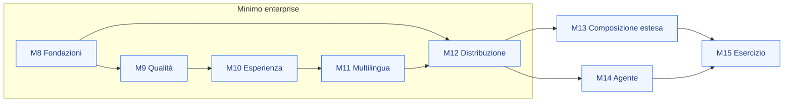

La **Fase 2** porta il Loyalty Hub da PoC dimostrativo (M0–M7) a prodotto *enterprise ready*: installabile da ogni azienda a partire da una sola immagine Docker, con identità reale, dati personali fuori dal bus, esperienza del portale configurabile senza rilasci e conformità verificata dal software. Il PoC resta come profilo `demo` della stessa immagine.

<Note>
  La specifica completa è `docs/18-FASE-2.md` nel repository; le decisioni sono le ADR 026–045 del [registro delle decisioni](/specifiche/registro-decisioni). Da M8.9 questa pagina è generata da `docs-sync`; fino ad allora è un riassunto.
</Note>

## Principi

- **Headless-first**: tutto ciò che mostra il portale è ottenibile dalle API documentate.
- **Dati personali mai sul bus** (ADR-032): gli eventi portano `memberId` e attributi non identificanti.
- **Minimo enterprise prima del tutto**: M8–M12 producono un prodotto installabile e sicuro; il resto dopo.
- **Tipi nel codice, istanze nei dati** (ADR-029): l'Element Registry definisce i tipi, le istanze cambiano senza rilascio.
- **Una sola immagine, più ruoli, due modalità** (ADR-037): appliance, compose e Kubernetes dallo stesso artefatto.
- **Solo pull request verso `main`** (ADR-041): una fetta, un ramo, una PR.

## Milestone

| Milestone | Risultato |
|---|---|
| M8 Fondazioni enterprise | immagine unica, OIDC con BFF, chart e compose, PII fuori dal bus, sicurezza, audit unificato, OpenAPI, documentazione |
| M9 Qualità | journey E2E con invarianti, matrice device, carico, test di installazione |
| M10 Esperienza | Element Registry, Directus come piano di composizione, `experience-service`, design system `brand`/`pa`, widget |
| M11 Multilingua | prefisso URL, stringhe estratte, testi di dominio localizzati |
| M12 Distribuzione | appliance, CLI `lh`, wizard, rilascio firmato, aggiornamento N−1 → N, pacchetto di conformità |
| M13–M15 | page builder, economia del programma, agente regolamento, esercizio |
